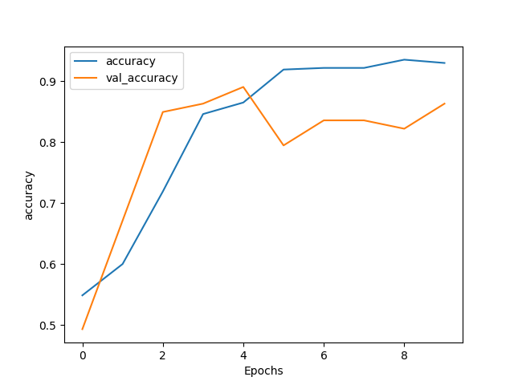
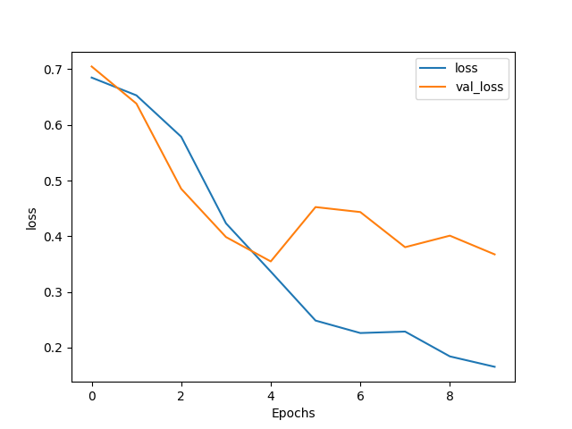

# Predicting mortality in sentences using pretrained Biobert models

## Setup
Python 3 is required. The models have been tested using python 3.8.5

1.  Clone repo:
    ```sh
    git clone git@github.com:Rutgerdj/mortalityPrediction.git
    cd mortalityPrediction/
    ```

2.  Setup environment:
    ```sh
    python3 -m virtualenv .env
    source .env/bin/activate
    pip install -r requirements.txt
    ```

3. Download the biobert pretrained ([files](https://github.com/naver/biobert-pretrained)) and extract them to a folder on your pc.

4. Convert the downloaded Tensorflow checkpoint to a Pytorch model:
    ```bash
    # make sure the environment is still active
    source .env/bin/activate

    cd <path_to_downloaded_bert_files>
    
    # convert checkpoint to pytorch model
    transformers-cli convert --model_type bert \
        --tf_checkpoint biobert_model.ckpt \
        --config bert_config.json \
        --pytorch_dump_output pytorch_model.bin
    ```
5. Rename files
    ```sh
    cd <path_to_downloaded_bert_files>

    # bert_config.json    -> config.json
    # biobert_model.ckpt* -> model.ckpt*
    mv bert_config.json config.json
    rename -v 's/biobert_model/model/' *
    ```

5.  Change the `"biobert_path"` value in `config.py` to the folder where you placed the biobert files. 

6. Run the model:
    ```
    python train.py
    ```

## First results

These are the results of the first tests:

### Accuracy per epoch


### Loss per epoch

